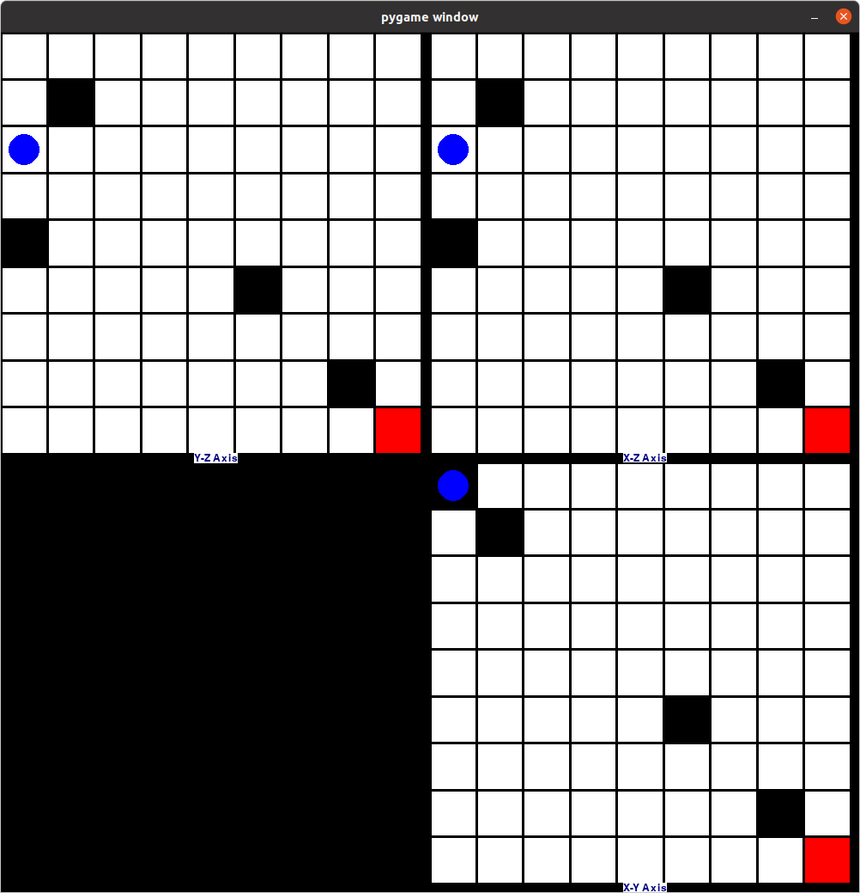
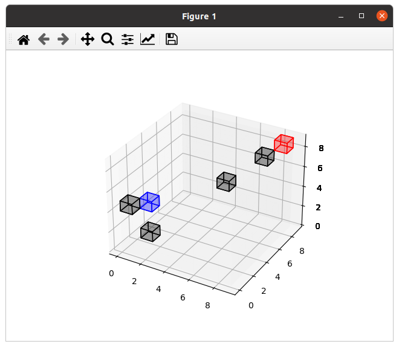

# CubeGym Environment for Training an RL Agent to Find the Optimal Path

This repository contains the code for the CubeGym environment. The environment includes a cube of
an arbitrary size which is divided into several smaller, the same-size, cubes, as can be seen
in the following figure. Several cells are occupied by obstacles, restricting the agent’s ability to pass
through them. We proceed with the assumption that the obstacles remain stationary and
do not undergo any relocation.
At every state, the agent has five potential movements: up, down, left, right, and forward.
We make the assumption that these transitions are certain.
Any of the above-mentioned characteristics can be changed!





## Running the Code

### Disclaimer
This code was tested on Ubuntu 20.04.
### Prerequisites

1. [Anaconda](https://www.anaconda.com/products/distribution) / [Miniconda](https://conda.io/projects/conda/en/stable/user-guide/install/download.html)

### Steps

1. Clone the repository

    ```
    git clone https://https://github.com/SajjiKazemi/cube_gym
    ```
2. From within the working directory, create the conda environment.

    ```
    conda create -f cube_gym_env.yml -n your-preferred-name
    ```
3. You should be good to go!
